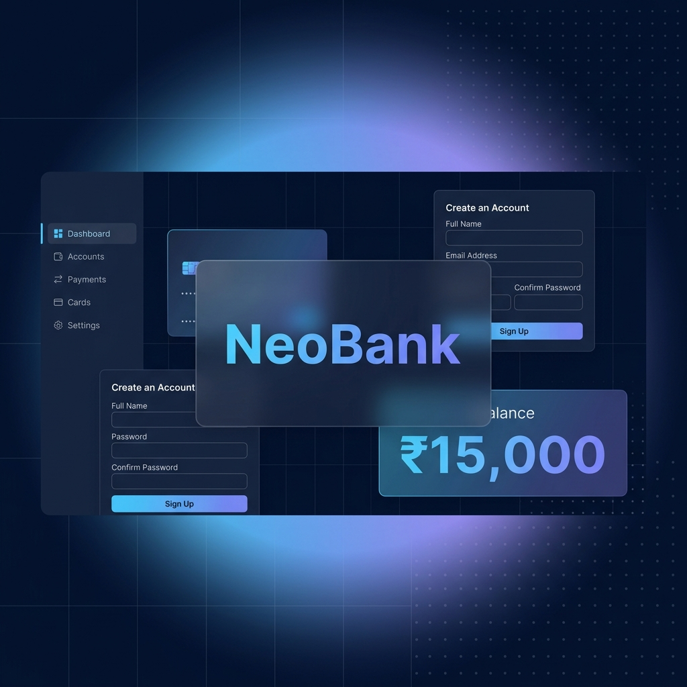

<div align="center">



<br/>
<br/>

# ⬡ NeoBank

### _**Your Personal Banking Terminal — Reimagined.**_

<br/>

[](https://www.python.org/)
[](https://streamlit.io/)
[](LICENSE)
[](https://github.com/ShashwatSingh-Stud/Management_App)

<br/>

> 🏦 A sleek, dual‑interface bank account manager — **dark-themed Streamlit dashboard** + **terminal CLI** — with PIN authentication, real-time balance tracking, and zero‑config JSON persistence.

<br/>

[🚀 Quick Start](#-quick-start) · [✨ Features](#-features) · [📖 Usage](#-usage-guide) · [🏗 Architecture](#-architecture) · [🤝 Contributing](#-contributing)

---

</div>

<br/>

## 🎯 What is NeoBank?

NeoBank is a **lightweight yet powerful** bank account management system built with Python. It ships with **two interfaces** — pick the one that suits your workflow:

<table>
<tr>
<td width="50%" align="center">
<br/>

**🖥️ Terminal CLI**

<br/>

Classic menu-driven experience.
Perfect for quick operations
right from your terminal.

```
python main.py
```

<br/>
</td>
<td width="50%" align="center">
<br/>

**🌐 Streamlit Dashboard**

<br/>

Premium dark-themed web UI
with glassmorphic cards,
gradient accents & live metrics.

```
streamlit run app.py
```

<br/>
</td>
</tr>
</table>

<br/>

---

<br/>

## ✨ Features

<div align="center">

```
  ╭──────────────────────────────────────────────────────────────╮
  │                                                              │
  │    ⊕  Create Account       with auto-generated account IDs  │
  │    ↑  Deposit Money         instant balance updates          │
  │    ↓  Withdraw Money        with overdraft protection        │
  │    ◈  View Details          full profile & balance card      │
  │    ✎  Update Profile        change name, email, or PIN       │
  │    ⊗  Close Account         with confirmation safeguard      │
  │                                                              │
  ╰──────────────────────────────────────────────────────────────╯
```

</div>

<br/>

| Capability | CLI | Web UI |
|:---|:---:|:---:|
| Create & manage accounts | ✅ | ✅ |
| Deposit & withdraw funds | ✅ | ✅ |
| PIN‑based authentication | ✅ | ✅ |
| Auto‑generated account numbers | ✅ | ✅ |
| Age validation (min 12 years) | ✅ | ✅ |
| Live dashboard metrics | — | ✅ |
| Dark glassmorphic UI with gradient theme | — | ✅ |
| Custom typography (Syne + DM Mono) | — | ✅ |

<br/>

---

<br/>

## 🛠 Tech Stack

<div align="center">

| Layer | Technology | Purpose |
|:---|:---|:---|
| **Language** |  | Core application logic |
| **Web Framework** |  | Interactive web dashboard |
| **Data Store** |  | Zero‑config file-based persistence |
| **Fonts** |  | Syne & DM Mono |

</div>

<br/>

---

<br/>

## 📂 Project Structure

```
Management_App/
│
├── 🎨 app.py              ← Streamlit web dashboard (dark-themed UI)
│                             Custom CSS, sidebar nav, gradient backgrounds,
│                             glassmorphic cards, live metric widgets
│
├── 💻 main.py             ← Terminal CLI application
│                             OOP-based Bank class, menu-driven interface,
│                             all CRUD operations via stdin/stdout
│
├── 🗄️ database.json        ← JSON flat-file database
│                             Array of user records with name, age, email,
│                             account number, PIN, and balance
│
├── 🖼️ assets/              ← Static assets
│   └── banner.png            README hero banner
│
└── 📄 README.md            ← You are here
```

<br/>

---

<br/>

## 🚀 Quick Start

### Prerequisites

- **Python 3.8+** installed ([download](https://www.python.org/downloads/))
- **pip** (comes with Python)

### 1️⃣ Clone the Repository

```bash
git clone https://github.com/ShashwatSingh-Stud/Management_App.git
cd Management_App
```

### 2️⃣ Install Dependencies

```bash
pip install streamlit
```

> [!NOTE]
> The CLI (`main.py`) uses **only the Python standard library** — no extra packages needed.

### 3️⃣ Launch

<table>
<tr>
<td>

**Terminal CLI**

```bash
python main.py
```

</td>
<td>

**Web Dashboard**

```bash
streamlit run app.py
```

Opens automatically at **http://localhost:8501**

</td>
</tr>
</table>

<br/>

---

<br/>

## 📖 Usage Guide

<details>
<summary><b>⊕ Create Account</b></summary>
<br/>

Provide your **name**, **age**, **email**, and a **4‑digit PIN** (1000–9999). The system auto‑generates a unique alphanumeric account number.

> [!IMPORTANT]
> Minimum age requirement is **12 years**. PINs must be exactly 4 digits.

</details>

<details>
<summary><b>↑ Deposit Money</b></summary>
<br/>

Authenticate with your **account number** and **PIN**, then enter the deposit amount. Your updated balance is displayed instantly with a gradient highlight in the web UI.

</details>

<details>
<summary><b>↓ Withdraw Money</b></summary>
<br/>

Authenticate and enter the withdrawal amount. The system enforces **overdraft protection** — you cannot withdraw more than your available balance.

</details>

<details>
<summary><b>◈ View Account Details</b></summary>
<br/>

Authenticate to see your full profile — **name**, **email**, **age**, **account number**, and **current balance** — displayed in a clean card layout on the web UI.

</details>

<details>
<summary><b>✎ Update Profile</b></summary>
<br/>

Change your **name**, **email**, or **PIN** after authentication. Leave fields blank to keep existing values unchanged.

</details>

<details>
<summary><b>⊗ Close Account</b></summary>
<br/>

Permanently delete your account after authentication. Requires explicit confirmation.

> [!CAUTION]
> This action is **irreversible**. All data and remaining balance will be permanently deleted.

</details>

<br/>

---

<br/>

## 🏗 Architecture

```
                    ┌─────────────────────────────────────────────┐
                    │              USER INTERFACES                │
                    │                                             │
                    │  ┌──────────────┐   ┌────────────────────┐  │
                    │  │  CLI         │   │  Web Dashboard     │  │
                    │  │  main.py     │   │  app.py            │  │
                    │  │              │   │                    │  │
                    │  │  • Terminal  │   │  • Streamlit       │  │
                    │  │  • Menu UI  │   │  • Dark Theme      │  │
                    │  │  • OOP      │   │  • Glassmorphic    │  │
                    │  └──────┬───────┘   └─────────┬──────────┘  │
                    │         │                     │              │
                    │         └──────────┬──────────┘              │
                    │                    │                         │
                    │         ┌──────────▼──────────┐              │
                    │         │   BUSINESS LOGIC    │              │
                    │         │                     │              │
                    │         │  • Account CRUD     │              │
                    │         │  • PIN Auth         │              │
                    │         │  • Balance Mgmt     │              │
                    │         │  • Validation       │              │
                    │         └──────────┬──────────┘              │
                    │                    │                         │
                    │         ┌──────────▼──────────┐              │
                    │         │   DATA LAYER        │              │
                    │         │                     │              │
                    │         │  database.json      │              │
                    │         │  (JSON flat-file)    │              │
                    │         └─────────────────────┘              │
                    └─────────────────────────────────────────────┘
```

### Data Schema

Each user record in `database.json`:

```json
{
  "name":       "string",       // Full name
  "age":        18,             // Must be ≥ 12
  "email":      "user@mail.com",// Email address
  "AccountNo.": "aB3d9Kz2",    // Auto-generated (8 chars, alphanumeric)
  "pin":        1234,           // 4-digit PIN (1000–9999)
  "Balance":    0               // Current balance in ₹
}
```

<br/>

---

<br/>

## 🤝 Contributing

Contributions, issues, and feature requests are welcome!

```bash
# 1. Fork this repo
# 2. Create your branch
git checkout -b feature/amazing-feature

# 3. Commit your changes
git commit -m "feat: add amazing feature"

# 4. Push and open a PR
git push origin feature/amazing-feature
```

### 💡 Ideas for Improvement

- [ ] 📊 Add transaction history / ledger
- [ ] 🔐 Implement password hashing for PINs
- [ ] 🗃️ Migrate from JSON to SQLite / PostgreSQL
- [ ] 💸 Add fund transfer between accounts
- [ ] ☁️ Deploy to Streamlit Cloud
- [ ] 📱 Add responsive mobile layout

<br/>

---

<br/>

<div align="center">

## 👤 Author

**Shashwat Singh**

[](https://github.com/ShashwatSingh-Stud)

<br/>

---

<sub>

Built with ❤️ using **Python** & **Streamlit**

⭐ Star this repo if you found it useful!

</sub>

</div>
